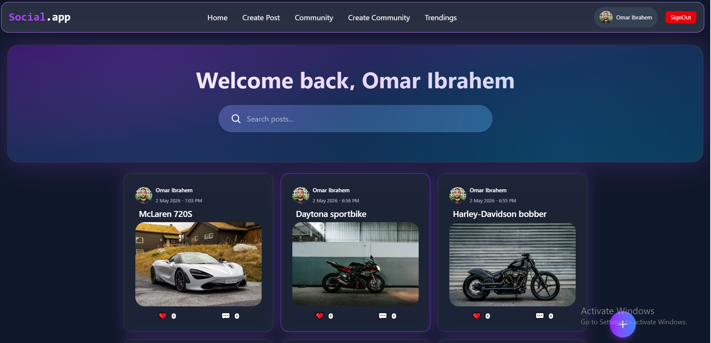
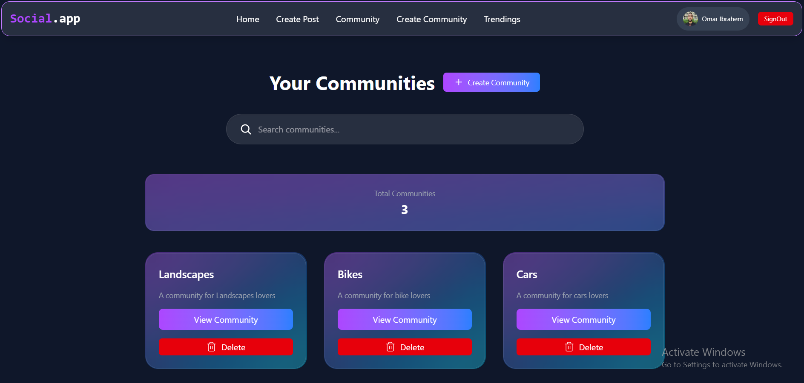
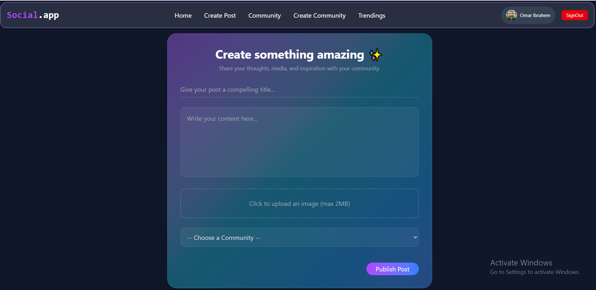
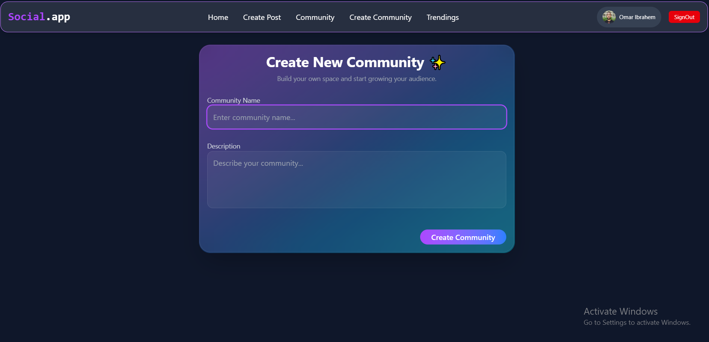
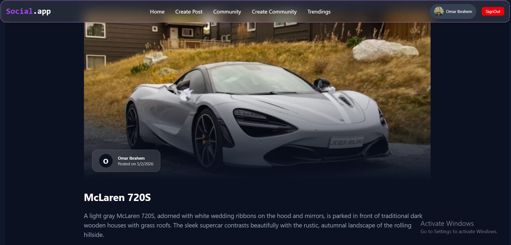
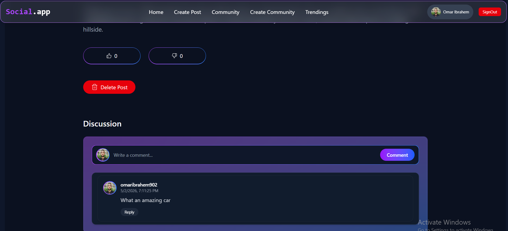
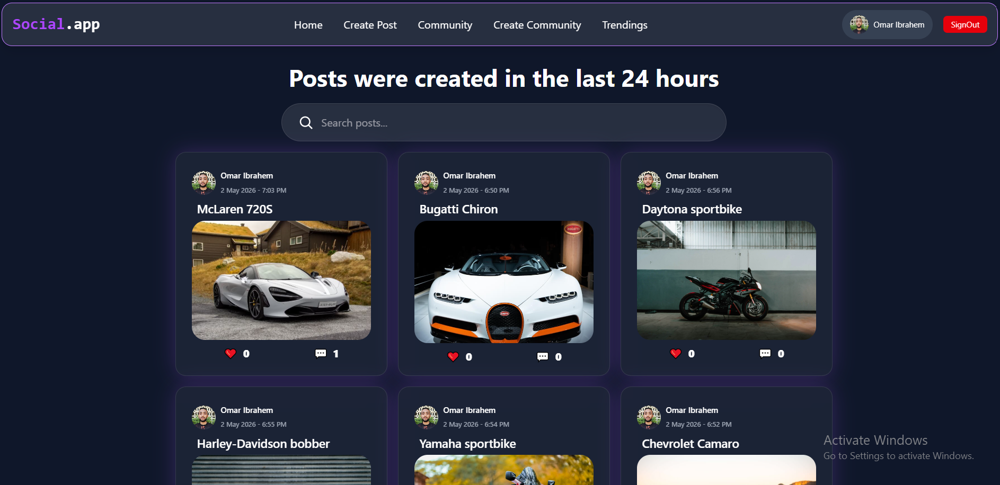
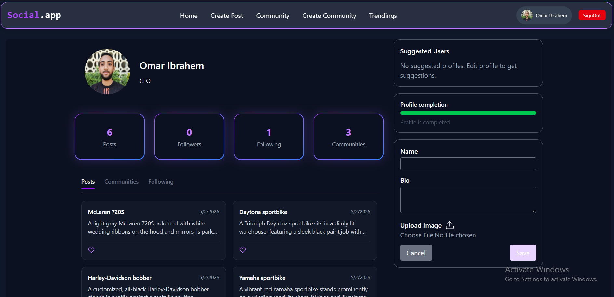

# Social Media App 🚀

A modern social media platform built with Next.js, TypeScript, and Supabase.  
Users can create posts, interact with others, and manage their profiles in real-time.

## ✨ Features

- 🔐 Authentication (Sign up / Login)
- 📝 Create, edit, and delete posts and communities
- ❤️ Like & comment system for posts
- 👤 User profile statistics
- ➕ Follow / unfollow users 
- 🔍 Search for posts and communities by title (instant filtering)
- 📈 View trending posts (based on activity in the last 24 hours)
- 📱 Fully responsive design
- ⚡ Real-time updates using Supabase

## 🛠 Tech Stack

- React
- TypeScript
- Supabase (Auth + Database)
- Tailwind CSS
- React Query
- React Router
- React hot toast
- React intersection observer
- Zustand state management

## Some Screen Shots

<p align="center">
  
  
</p>
<p align="center">
  
  
</p>
<p align="center">
  
  
</p>
<p align="center">
  
  
</p>

## 🌍 Live Demo

👉 https://supabase-social-app.vercel.app/

## ⚙️ Installation

```bash
git clone https://github.com/omaribrahem902/supabase-social-app.git
cd SOCIAL-MEDIA-PROJECT
npm install
npm dev

## 🧠 Challenges & Learnings

- Handling real-time updates efficiently
- Managing global state with React Query
- Handling fetching large data via pagination
- Structuring scalable frontend architecture

## 💼 Why This Project?

This project demonstrates my ability to build scalable frontend applications with real-time features and modern UI/UX.
